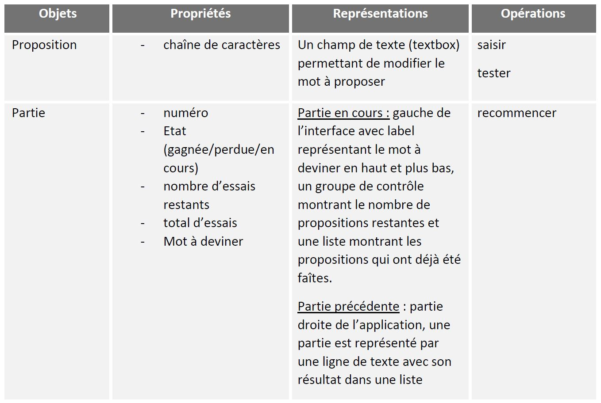
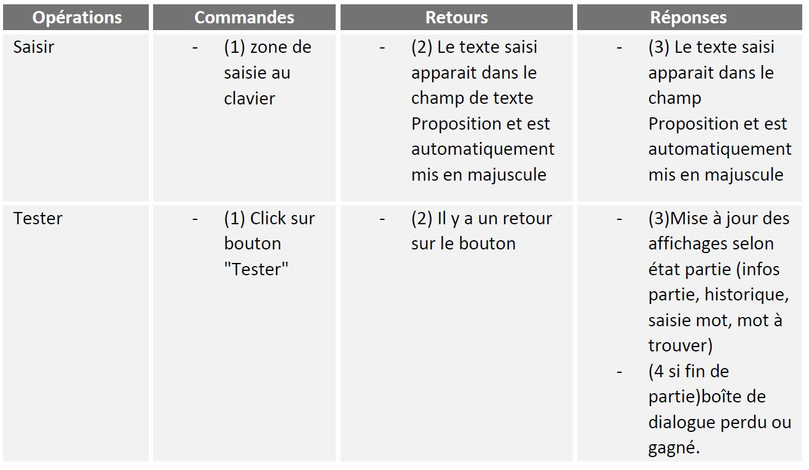
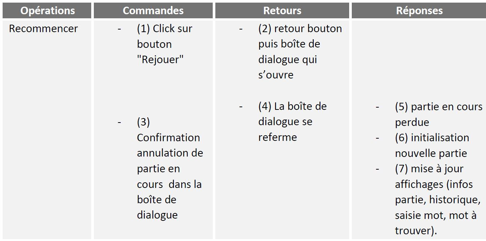

## Le sujet
Réaliser un jeu d'anagramme en WPF!

Les fonctionnalités attendues sont :
- L'utilisateur peut jouer une partie d'Anagramme, où il faut retrouver le mot qui se cache derrière le mot mélangé
    - Il peut faire des propositions de réponses
    - Il peut consulter / visualiser les propositions précédentes
    - Il a un nombre limité de tentatives pour une partie
- Si le mot est trouvé, la partie est gagnée (MessageBox correspondante)
- Si le mot n'est pas trouvé à l'issu des tentatives, la partie est perdue (MessageBox correspondante)
- L'utilisateur peut relancer une nouvelle partie à tout moment, la partie en cours est considérée perdue
- A la fin d'une partie Gagnée ou Perdue, le système demande à l'aide d'un MessageBox à l'utilisateur s'il souhaite refaire une partie
- Le système conserve l'historique des parties

Voici la table fonctionnelle des objets de cette application :

Voici la table fonctionnelle des opérations pour l’objet **proposition** : 

Voici la table fonctionnelle des opérations pour l’objet **partie** : 

## Auteur
Ce projet a été réalisé par Taycir Ben Ouirane.
